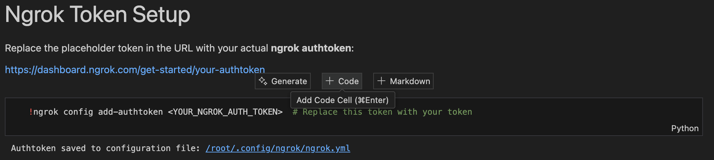
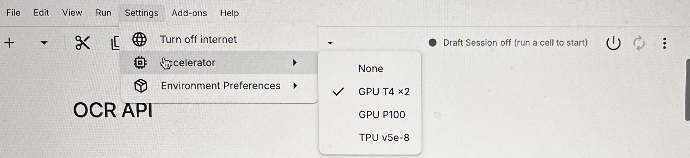
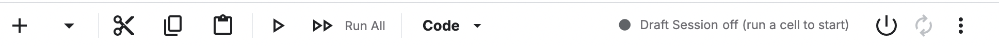

# Introduction

In this notebook, we developed an OCR API designed to extract text from images. For this purpose, we leveraged an open-source model available through Hugging Face.

# How to Set Up the OCR-API

Before running any part of the code, you must first set up the **OCR-API**. Follow the steps below:

---

## 1. Create a Kaggle Account

1. Go to [Kaggle](https://www.kaggle.com/).
2. If you don’t already have an account, sign up for a new one.

---

## 2. Upload the Notebook

1. Upload the `ocr-api.ipynb` file to your Kaggle workspace.

---

## 3. Set Up Ngrok

1. Create an account on [Ngrok](https://dashboard.ngrok.com/login).
2. After signing up, go to: [Get Your Authtoken](https://dashboard.ngrok.com/get-started/your-authtoken).
3. Copy your **authtoken** — this will allow you to create a secure tunnel between your notebook and the API.

---

## 4. Configure the Token

1. Open the `ocr-api.ipynb` file in Kaggle.
2. Replace the placeholder token with your copied **Ngrok Authtoken**.

   

---

## 5. Enable GPU Accelerator

1. Go to **Settings > Accelerator**.
2. Select **GPU T4 x2** as your accelerator option.



---

## 6. Start the Session

1. Launch the Kaggle notebook session.
2. Click on **Run All** to execute all cells.

   

---

## 7. Wait for the API to Start

* After about **1–3 minutes**, the last cell will display a URL that looks like this:

  ```
  https://fcb2c5a30639.ngrok-free.app
  ```
* This is your **OCR API endpoint**.

---

## 8. Using the API

* The API accepts **image input** and returns **extracted text**.
* Instructions on how to use this API are available in the **main README file**.


